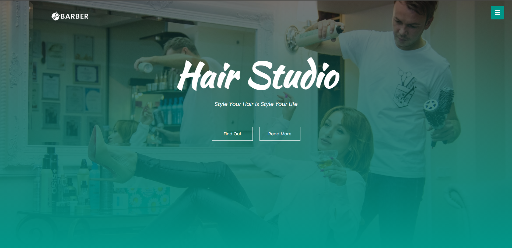

# Website de um salão de cabeleireiro

 
 - Website de salão de cabeleireiro

 - Projeto construído durante o curso PROPROFISSÃO.

## Acesso
 [Clique aqui para acessar! :)](https://github.com/GuilhermeSK2/Barber-Landing-Page)

## Tecnologias

- HTML
- CSS
- Git e Github

## Contato
[(LinkedIn)](https://www.linkedin.com/in/guilherme-freitas-9901a220b/)
-----
guilhermefsantos150@gmail.com
